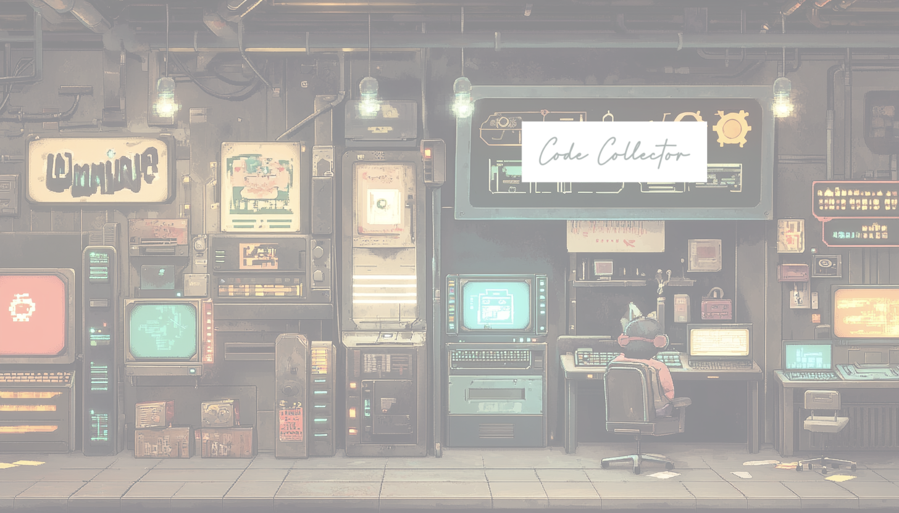

# 🎮 ¡Aventura Code Collector! 

## 🚀 Descripción
¡Bienvenido a Code Collector - un emocionante juego educativo donde te conviertes en un héroe de la programación recolectando símbolos de HTML, CSS y JavaScript mientras evitas esos molestos errores de sintaxis! Perfecto para jóvenes programadores y cualquiera que quiera divertirse mientras se familiariza con conceptos de desarrollo web.

## 🎯 Objetivo del Juego
Ayuda a nuestro intrépido programador a recolectar símbolos de lenguajes de programación mientras esquiva errores de sintaxis. ¿Podrás alcanzar los 20 puntos y convertirte en un maestro del código?

### 🏆 Sistema de Puntuación
- Recolectar símbolos de HTML, CSS o JavaScript: +1 punto
- Chocar con un error de sintaxis: -1 punto
- Victoria alcanzada en: 20 puntos

## 🎹 Controles
- **→** Mover derecha
- **←** Mover izquierda
- **↑** Saltar
- ¡Puedes hacer doble salto! 🦘

## 🎨 Características
- 🎵 Música de fondo divertida (se puede activar/desactivar)
- 🎯 Contador de puntos
- 🎊 Animación de victoria
- 🔊 Efectos de sonido al recolectar símbolos y chocar con errores
- 🏃‍♂️ Movimientos animados del personaje
- 🎭 Estados dinámicos del personaje (caminando/saltando)

## 🛠️ Detalles Técnicos
El juego está construido usando:
- JavaScript puro con Programación Orientada a Objetos
- HTML5 para la estructura del juego
- CSS3 para estilos y animaciones
- Herencia de clases para las entidades del juego
- Sistema de detección de colisiones
- Gestión dinámica de sprites

## 🎮 Elementos del Juego
- **Personaje Principal**: Un valiente programador con mochila
- **Coleccionables**: Símbolos de HTML, CSS y JavaScript
- **Obstáculos**: Iconos de error de sintaxis para evitar
- **Fondo**: Ambiente temático de programación

## 🌟 Características Especiales
- Mecánica de doble salto
- Reaparición automática de coleccionables
- Animaciones suaves del personaje
- Detección de colisiones precisa
- Control de música de fondo
- Pantalla de victoria con animación de celebración

## 🏃‍♂️ Cómo Ejecutar
1. Clona el repositorio
2. Abre `index.html` en tu navegador
3. ¡Empieza a recolectar esos símbolos de programación! 🎉

## 🎵 Créditos de Audio
- Música de Fondo: "O Coelhinho que Caçava Balões"
- Sonido de Recolección: "Ding Idea"
- Sonido de Error: "Error Alert"

## 🎨 Estilo Visual
El juego presenta una estética divertida y temática de programación con:
- Símbolos de programación en pixel art
- Sprites animados del personaje
- Fondo temático de programación
- Esquema de color: Fondo oscuro con coleccionables vibrantes

¡Diviértete recolectando código y convirtiéndote en un maestro de la programación! 🚀✨

